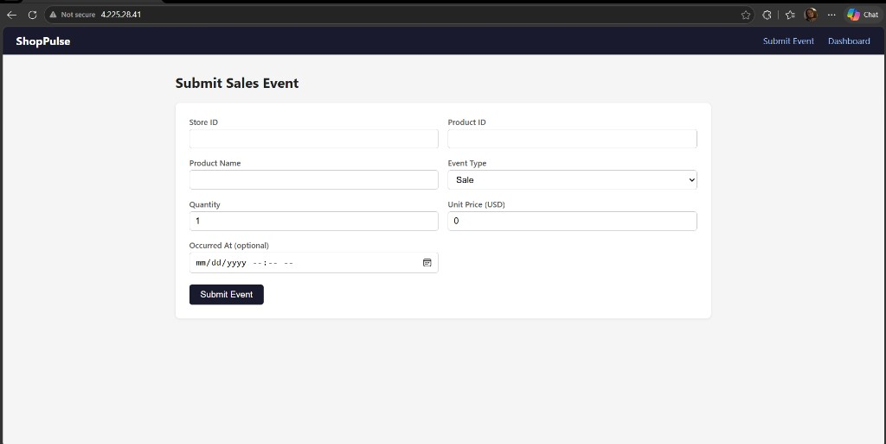
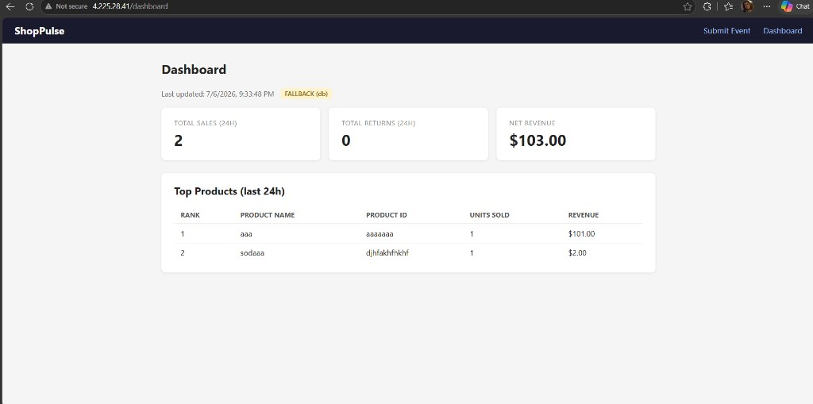

# ShopPulse on Azure — study deployment notes

This folder contains Terraform infrastructure and Kubernetes manifests used to deploy the [ShopPulse](../repo/shoppulse) application to **Azure Kubernetes Service (AKS)**.

This was a **time-boxed study exercise**, not a production deployment. AKS and a working demo app were achieved, but several parts of the target architecture were simplified or skipped. I plan to rework this properly when there is more time.

---

## Data-layer task (Jul 2026) — done, then torn down

Terraform for **ACR + Key Vault + Redis + PostgreSQL** was applied and verified, then the resource group was deleted to stop student-subscription spend. Details (including Redis retirement → Managed Redis): [`terraform/README.md`](terraform/README.md).

**No public app URL for that task** — AKS / App Gateway / website were out of scope. Old demo `http://4.225.28.41/` was from an earlier AKS experiment and is not current.

Local UI: `cd repo/shoppulse && docker compose up --build` → http://localhost:3000

### Earlier AKS experiment (historical)

| Stack | Path | Notes |
|-------|------|--------|
| AKS + AGIC | `terraform/infra/aks` | Was applied in an earlier iteration; not part of the data-layer hand-in |
| App demo URL | — | Was `http://4.225.28.41/` while that cluster existed |

### Demo screenshots

Submit Event form — app reachable via App Gateway public IP:



Dashboard with test data (FALLBACK db mode — worker not deployed):



---

## What works vs what does not

| Feature | Status |
|---------|--------|
| AKS cluster | Yes |
| Site in browser via App Gateway | Yes |
| Submit sales events → stored in Postgres | Yes |
| Dashboard | Yes, **FALLBACK (db)** mode only |
| **LIVE (cache)** dashboard | No — requires `worker` + warm Redis cache |
| Azure Service Bus pipeline | No — worker and emulator not deployed |
| Workload Identity to Azure PaaS | Prepared in Terraform, not used by app secrets yet |

The yellow **FALLBACK (db)** badge is expected: the API reads Postgres directly when Redis has no cached summary (see ShopPulse repo README).

---

## Workarounds and issues encountered

These are honest notes for reviewers — not hidden failures.

1. **VM size** — `Standard_B2s` is not available in `swedencentral` on this subscription; used `Standard_B2s_v2`.

2. **AKS service CIDR** — default `10.0.0.0/16` overlapped the VNet; set `service_cidr = 10.1.0.0/16` in the AKS stack.

3. **ACR private registry** — `docker push` from WSL failed until public network access was enabled on ACR. `az acr build` is blocked on **Azure for Students** (`TasksOperationsNotAllowed`).

4. **Single-node CPU** — `worker`, Service Bus emulator, and SQL Edge could not schedule (`Insufficient cpu`). Removed from the active manifest set; only core app + in-cluster DB/cache run.

5. **Application Gateway / AGIC**
   - AGIC identity needed **Network Contributor** on the VNet to join `appgw-subnet`.
   - App Gateway creation takes **10–20 minutes** on first run.
   - NSG on `appgw-subnet` needed an inbound rule for **HTTP (80)**, not only HTTPS.
   - After App Gateway became ready, Ingress `ADDRESS` stayed empty until:
     ```bash
     kubectl annotate ingress shoppulse -n shoppulse appgw.ingress.azure.io/force-sync=true --overwrite
     ```

6. **Terraform role assignment** — if `agic_vnet_contributor` fails with `RoleAssignmentExists`, import the existing assignment or create it once manually with `az role assignment create`.

---

## Manual deployment steps (no helper scripts)

Assumes WSL, `az` CLI logged in, Docker, and `kubectl` installed (`az aks install-cli`).

Copy local config from examples (never commit real `env/*.tfvars` or `k8s/secret.yaml`):

```bash
cd ~/STUDY/terraform/env
cp common.tfvars.example common.tfvars
cp postgresql.tfvars.example postgresql.tfvars
cp acr.tfvars.example acr.tfvars
cp servicebus.tfvars.example servicebus.tfvars
cp redis.tfvars.example redis.tfvars
cp keyvault.tfvars.example keyvault.tfvars
# fill in values, then:
cp ~/STUDY/k8s/secret.yaml.example ~/STUDY/k8s/secret.yaml
```

### 1. Terraform

```bash
cd ~/STUDY/terraform
bash scripts/link-env.sh

cd infra/base && terraform init && terraform apply
cd ../network && terraform init && terraform apply
cd ../security/identity && terraform init && terraform apply
cd ../acr && terraform init && terraform apply
cd ../../aks && terraform init && terraform apply
```

### 2. Container images → ACR

```bash
az acr update --name shoppulseacr --public-network-enabled true
az acr login --name shoppulseacr

cd ~/STUDY/repo/shoppulse
docker build -t shoppulseacr.azurecr.io/api:latest ./api
docker build -t shoppulseacr.azurecr.io/worker:latest ./worker
docker build --build-arg VITE_API_BASE_URL= -t shoppulseacr.azurecr.io/front-end:latest ./frontend
docker push shoppulseacr.azurecr.io/api:latest
docker push shoppulseacr.azurecr.io/worker:latest
docker push shoppulseacr.azurecr.io/front-end:latest
```

### 3. Kubernetes

```bash
az aks get-credentials -g ShopPulse-ResGroup -n shoppulse-aks
kubectl apply -k ~/STUDY/k8s/
```

If Ingress has no `ADDRESS` after App Gateway is **Running**:

```bash
kubectl annotate ingress shoppulse -n shoppulse appgw.ingress.azure.io/force-sync=true --overwrite
kubectl get ingress shoppulse -n shoppulse
```

### 4. Verify

```bash
kubectl get nodes
kubectl get pods -n shoppulse
curl -s http://<APPGW_IP>/api/events
```

Open `http://<APPGW_IP>/` and submit a test event on **Submit Event**; refresh **Dashboard**.

---

## Repository layout

```
STUDY/
├── README.md           ← this file
├── docs/screenshots/   ← demo images referenced in README
├── terraform/          ← Azure infra (split stacks + remote state)
├── k8s/                ← Kustomize manifests for ShopPulse on AKS
└── repo/shoppulse/     ← application source (clone)
```

---

## Planned improvements (next iteration)

- Apply Azure PostgreSQL, Redis, and Service Bus stacks; wire secrets from Terraform outputs or Key Vault.
- Deploy `worker`; target **LIVE (cache)** dashboard.
- Scale node pool or use a larger VM SKU (e.g. `Standard_B4s_v2`).
- Keep ACR private; push via CI or self-hosted runner inside the VNet.
- Add App Gateway WAF policy and HTTPS listener.
- Remove in-cluster Postgres/Redis once Azure PaaS is in place.

---

## Subscription context

- Subscription: Azure for Students  
- Region: `swedencentral`  
- Resource group: `ShopPulse-ResGroup`  
- AKS cluster: `shoppulse-aks`
