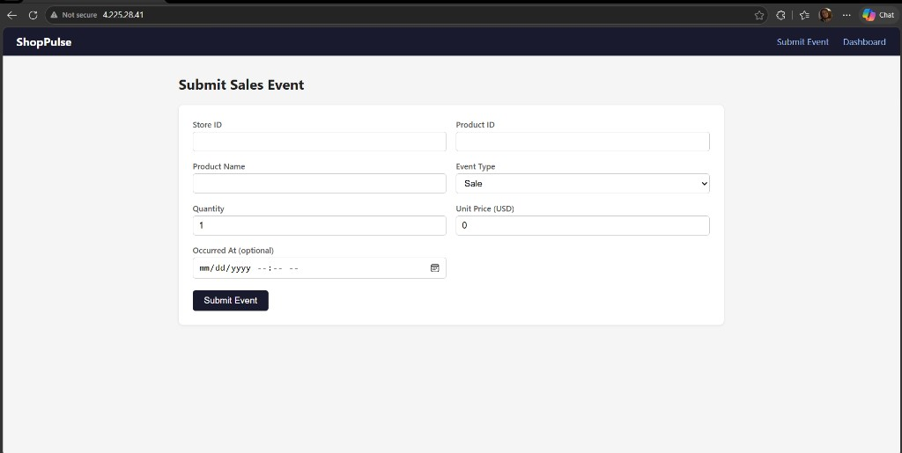
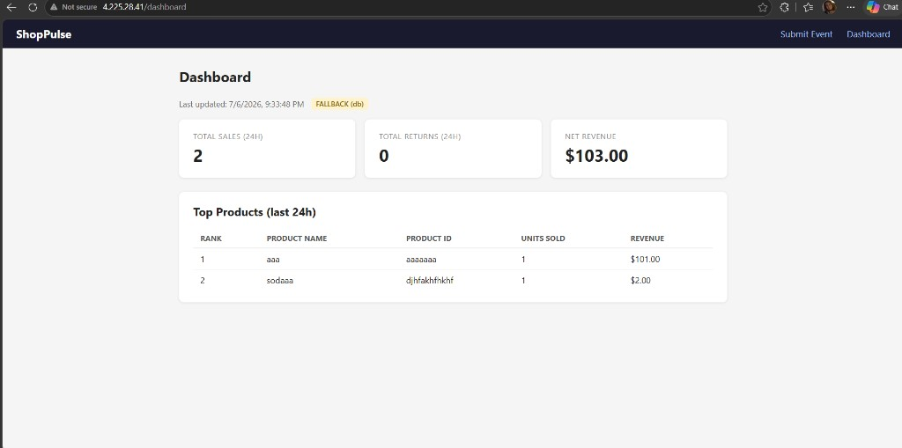

# ShopPulse on Azure — study deployment notes

This folder contains Terraform infrastructure and Kubernetes manifests used to deploy the [ShopPulse](../repo/shoppulse) application to **Azure Kubernetes Service (AKS)**.

This was a **time-boxed study exercise**, not a production deployment. AKS and a working demo app were achieved, but several parts of the target architecture were simplified or skipped. I plan to rework this properly when there is more time.

---

## What was deployed

### Terraform (Azure)

| Stack | Path | Status |
|-------|------|--------|
| Resource group | `terraform/infra/base` | Applied |
| VNet, subnets, NSGs | `terraform/infra/network` | Applied |
| User-assigned managed identity | `terraform/infra/security/identity` | Applied |
| Azure Container Registry | `terraform/infra/security/acr` | Applied (`shoppulseskacr01`) |
| Key Vault | `terraform/infra/security/keyvault` | Applied (`shoppulseskkv01`) |
| PostgreSQL Flexible Server | `terraform/infra/dbs/postgresql` | Applied (`shoppulse-pgsql`) |
| Service Bus Premium | `terraform/infra/dbs/servicebus` | Applied (`shoppulse-messaging`) |
| Managed Redis | `terraform/infra/dbs/redis` | Applied (`shoppulse-redis`, norwayeast) |
| AKS + Application Gateway Ingress Controller (AGIC) | `terraform/infra/aks` | Applied |

Data-layer details, caveats (Redis SKU/region), CLI verification logs, and a full raise guide: see **[README-data.md](README-data.md)**.

### Kubernetes

| Workload | Notes |
|----------|--------|
| `api`, `front-end` | Running; images from ACR |
| `postgres`, `redis` | In-cluster (same idea as local `docker-compose`), not Azure PaaS |
| `worker` | **Not deployed** — single B2s node ran out of CPU |
| Ingress | `azure-application-gateway` → public App Gateway IP |

**Live demo URL (at time of deployment):** `http://4.225.28.41/`  
(App Gateway public IP — may change if the cluster is recreated.)

### Demo screenshots

Submit Event form — app reachable via App Gateway public IP:



Dashboard with test data (FALLBACK db mode — worker not deployed):



---

## What works vs what does not

| Feature | Status |
|---------|--------|
| AKS cluster | Yes |
| Site in browser via App Gateway | Yes |
| Submit sales events → stored in Postgres | Yes |
| Dashboard | Yes, **FALLBACK (db)** mode only |
| **LIVE (cache)** dashboard | No — requires `worker` + warm Redis cache |
| Azure Service Bus pipeline | No — worker and emulator not deployed |
| Workload Identity to Azure PaaS | Prepared in Terraform, not used by app secrets yet |

The yellow **FALLBACK (db)** badge is expected: the API reads Postgres directly when Redis has no cached summary (see ShopPulse repo README).

---

## Workarounds and issues encountered

These are honest notes for reviewers — not hidden failures.

1. **VM size** — `Standard_B2s` is not available in `swedencentral` on this subscription; used `Standard_B2s_v2`.

2. **AKS service CIDR** — default `10.0.0.0/16` overlapped the VNet; set `service_cidr = 10.1.0.0/16` in the AKS stack.

3. **ACR private registry** — `docker push` from WSL failed until public network access was enabled on ACR. `az acr build` is blocked on **Azure for Students** (`TasksOperationsNotAllowed`).

4. **Single-node CPU** — `worker`, Service Bus emulator, and SQL Edge could not schedule (`Insufficient cpu`). Removed from the active manifest set; only core app + in-cluster DB/cache run.

5. **Application Gateway / AGIC**
   - AGIC identity needed **Network Contributor** on the VNet to join `appgw-subnet`.
   - App Gateway creation takes **10–20 minutes** on first run.
   - NSG on `appgw-subnet` needed an inbound rule for **HTTP (80)**, not only HTTPS.
   - After App Gateway became ready, Ingress `ADDRESS` stayed empty until:
     ```bash
     kubectl annotate ingress shoppulse -n shoppulse appgw.ingress.azure.io/force-sync=true --overwrite
     ```

6. **Terraform role assignment** — if `agic_vnet_contributor` fails with `RoleAssignmentExists`, import the existing assignment or create it once manually with `az role assignment create`.

---

## Manual deployment steps

Assumes WSL, `az` CLI logged in, Docker, and `kubectl` installed (`az aks install-cli`).

**Full raise guide (all stacks, Redis caveats, CLI checks):** [README-data.md](README-data.md) — section *How to raise*.

Short path:

```bash
cd ~/STUDY/terraform/env
cp common.tfvars.example common.tfvars
cp acr.tfvars.example acr.tfvars
cp keyvault.tfvars.example keyvault.tfvars
cp postgresql.tfvars.example postgresql.tfvars
cp redis.tfvars.example redis.tfvars
cp servicebus.tfvars.example servicebus.tfvars
# fill values; never commit real *.tfvars
cp ~/STUDY/k8s/secret.yaml.example ~/STUDY/k8s/secret.yaml

cd ~/STUDY/terraform
bash scripts/link-env.sh

# order: base → network → security/identity → security/acr → security/keyvault
#      → dbs/postgresql → dbs/servicebus → aks → dbs/redis
bash scripts/tf.sh base init && bash scripts/tf.sh base apply
# …repeat for each stack (see README-data.md)
```

### Images → ACR

```bash
az acr update -n shoppulseskacr01 --public-network-enabled true
az acr login -n shoppulseskacr01

cd ~/STUDY/repo/shoppulse
docker build -t shoppulseskacr01.azurecr.io/api:latest ./api
docker build -t shoppulseskacr01.azurecr.io/worker:latest ./worker
docker build --build-arg VITE_API_BASE_URL= -t shoppulseskacr01.azurecr.io/front-end:latest ./frontend
docker push shoppulseskacr01.azurecr.io/api:latest
docker push shoppulseskacr01.azurecr.io/worker:latest
docker push shoppulseskacr01.azurecr.io/front-end:latest
```

### Kubernetes

```bash
az aks get-credentials -g ShopPulse-ResGroup -n shoppulse-aks
kubectl apply -k ~/STUDY/k8s/
```

If Ingress has no `ADDRESS` after App Gateway is **Running**:

```bash
kubectl annotate ingress shoppulse -n shoppulse appgw.ingress.azure.io/force-sync=true --overwrite
kubectl get ingress shoppulse -n shoppulse
```

### Verify

```bash
kubectl get nodes
kubectl get pods -n shoppulse
curl -s http://<APPGW_IP>/api/events
```

Open `http://<APPGW_IP>/` and submit a test event on **Submit Event**; refresh **Dashboard**.

---

## Repository layout

```
STUDY/
├── README.md           ← this file (overview + short deploy)
├── README-data.md      ← data-layer notes + full raise guide
├── docs/screenshots/   ← demo images referenced in README
├── terraform/          ← Azure infra (split stacks + remote state)
├── k8s/                ← Kustomize manifests for ShopPulse on AKS
└── repo/shoppulse/     ← application source (clone)
```

---

## Planned improvements (next iteration)

- Wire app fully to Azure Postgres / Managed Redis / Service Bus (drop in-cluster deps + emulator).
- Deploy `worker`; prove SB E2E; target **LIVE (cache)** dashboard.
- Scale node pool or use a larger VM SKU (e.g. `Standard_B4s_v2`).
- Keep ACR private; push via CI or self-hosted runner inside the VNet.
- Add App Gateway WAF policy and HTTPS listener.

---

## Subscription context

- Subscription: Azure for Students  
- Region: `swedencentral`  
- Resource group: `ShopPulse-ResGroup`  
- AKS cluster: `shoppulse-aks`
